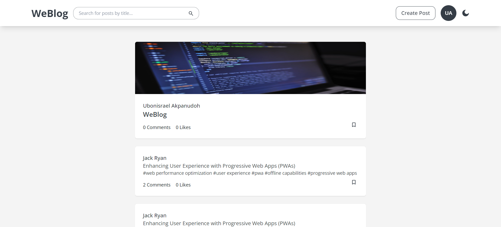

# WeBlog - A Modern Blog Platform



## Description
WeBlog is a community-driven blog where members come together to share their stories, ideas and opinions about a wide range of events and subjects. Weblog is a platform designed to support and encourage authentic voices, diverse perspectives and meaningful discussions. The goal of this project was to put to use knowledge acquired during the course of this program and challenge the limits of what we thought we could achieve.

## Project Architecture
### Overview
Our project follows a client-server model where the frontend (client) and backend (server) are separate entities. The client sends requests to the server, and the server processes these requests, interacts with the database, and returns the necessary data to the client.  
This is achieved by making the backend expose RESTful APIs that the frontend consumes. These APIs allow the frontend to perform CRUD (Create, Read, Update, Delete) operations on the backend resources.

### Frontend
The frontend is built using React, a JavaScript library for building user interfaces in the form of reusable code components and React Router (a React framework) for handling client-side routing. This library allows for navigating between different pages or views without refreshing the entire page.

### Backend
The backend is built using Flask, a lightweight Python framework. Flask handles routing, request processing, and serves as the bridge between the client and the database. Flask-Login was used to simplify the process of user authentication and session handling, and Flask-CORS to enable the frontend communicate with the backend from different origins. SQLAlchemy was used for database operations (mapping Python objects to tables) with MySQL.

## Get Project Up and Running

### Frontend
+ You must have NodeJS (version >= 21.5.0) installed and running on your operating system.
+ You must have Node Package Manager (version >= 10.2.4) installed and running on your operating system.
+ You will need to change directory to the `frontend` folder before running these commands.
    ```
    npm install # downloads and installs frontend dependencies
    npm run build # compiles frontend code and stores the output in the 'dist' folder
    ```

### Backend
+ Create a virtual environment and activate it
    ```
    python3 -m venv <virtual-environment-name>
    source <virtual-environment-name>/bin/activate
    ```

+ Install project dependencies
    ```
    pip3 install -r requirements.txt
    ```

+ Run the setup_sql_server.sql script to setup the database in your mysql server
    ```
    cat setup_sql_server.sql | mysql -uroot -p
    ```

+ To be able to run the flask app, create a .env file and add the following
    ```
    export SECRET_KEY=<your_secret_key> # just generate a random string
    export DEBUG=True
    export APP_SETTINGS=config.DevelopmentConfig
    export FLASK_DEBUG=1
    export WEBLOG_DEV=<admin>
    export WEBLOG_DEV_PWD=<password>
    export WEBLOG_DB=<name_of_db>
    export WEBLOG_HOST=localhost
    export WEBLOG_ENV=development
    export SECURITY_PASSWORD_SALT=<your_secret_key> # just generate a random string
    export MAIL_DEFAULT_SENDER=example@gmail.com
    export MAIL_PASSWORD=<gmail_password> # create app password on gmail
    export MAIL_USERNAME=example@gmail.com # must be gmail

    ```

### Run the app
```
python3 -m flask --app api.v1.app run
```


## Authors
+ Ubonisrael Akpanudoh
    + Role: Fullstack Developer
    + Email: akpanudohubonisrael@gmail.com

+ Ikpenyi Ifeanyi
    + Role: Backend Developer
    + Email: ifeanyiikpenyi@yahoo.com

## License
This project is licensed under the MIT License - see the [LICENSE](./LICENSE) file for details.
